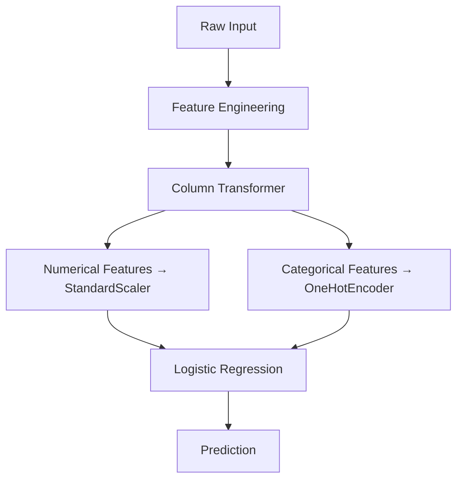
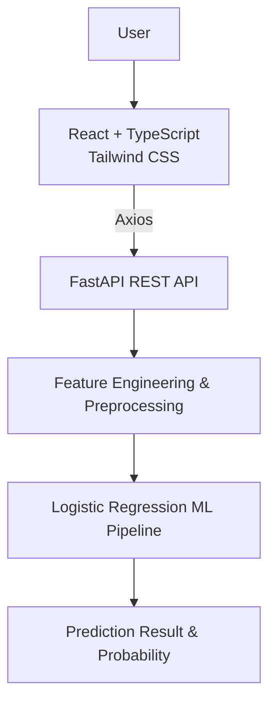

<div align="center">

# 🛒 Online Shoppers Purchasing Intention Prediction

### Predicting Online Shopper Purchase Behavior using Machine Learning

A Machine Learning based full-stack web application that predicts whether an
online shopper is likely to make a purchase based on their browsing session
information. The system uses the **Online Shoppers Purchasing Intention
Dataset** and applies data preprocessing, exploratory data analysis, feature
engineering, machine learning model development, evaluation, and deployment
through a REST API.

The trained Machine Learning model is integrated with a modern web
application using **React, TypeScript, Tailwind CSS, and FastAPI**.


</div>

---

## 📌 Table of Contents

- [Project Overview](#-project-overview)
- [Objectives](#-objectives)
- [Machine Learning Problem](#-machine-learning-problem)
- [Dataset](#-dataset)
- [Features](#-features)
- [Exploratory Data Analysis](#-exploratory-data-analysis)
- [Data Preprocessing](#-data-preprocessing)
- [Feature Engineering](#️-feature-engineering)
- [Feature Preprocessing (Pipeline)](#-feature-preprocessing-pipeline)
- [Train-Test Split](#-train-test-split)
- [Machine Learning Models](#-machine-learning-models)
- [Model Evaluation](#-model-evaluation)
- [Final Model](#-final-model)
- [Machine Learning Pipeline](#-machine-learning-pipeline)
- [System Architecture](#️-system-architecture)
- [Frontend](#️-frontend)
- [Backend](#-backend)
- [API Endpoints](#-api-endpoints)
- [Prediction Endpoint](#-prediction-endpoint)
- [Application Workflow](#-application-workflow)
- [Project Structure](#-project-structure)
- [Technologies Used](#️-technologies-used)
- [Installation and Setup](#-installation-and-setup)
- [Frontend-Backend Integration](#-frontend-backend-integration)
- [Testing](#-testing)
- [Project Notebooks](#-project-notebooks)
- [Saved Model Files](#-saved-model-files)
- [API CORS Configuration](#-api-cors-configuration)
- [Model Information](#-model-information)
- [Key Features of the Application](#-key-features-of-the-application)
- [Future Improvements](#-future-improvements)
- [Academic Project](#-academic-project)
- [Author](#-author)
- [License](#-license)
- [Acknowledgement](#-acknowledgement)

---

## 📖 Project Overview

The **Online Shoppers Purchasing Intention Prediction** system is a Machine
Learning based web application designed to predict whether an online visitor
is likely to make a purchase.

The system analyzes different browsing session characteristics such as:

- Number of administrative pages visited
- Number of informational pages visited
- Number of product-related pages visited
- Time spent on different page categories
- Bounce rate
- Exit rate
- Page values
- Visitor type
- Traffic type
- Operating system
- Browser
- Region
- Weekend activity
- Special day information

The application allows a user to enter these session details through a web
interface and receive a prediction from the trained Machine Learning model.

The prediction includes:

- Purchase / No Purchase result
- Purchase probability
- Model confidence
- Prediction message

---

## 🎯 Objectives

The main objectives of this project are:

- Analyze online shopper behavior.
- Understand the factors that influence online purchases.
- Perform Exploratory Data Analysis (EDA).
- Clean and preprocess the dataset.
- Remove duplicate records.
- Engineer meaningful features.
- Prepare the dataset for Machine Learning.
- Develop multiple classification models.
- Compare model performance.
- Select a suitable final model.
- Save the trained Machine Learning model.
- Develop a REST API using FastAPI.
- Develop a responsive frontend using React and TypeScript.
- Integrate the Machine Learning model with the full-stack application.
- Provide real-time purchase intention predictions.

---

## 🧠 Machine Learning Problem

This project is a **Supervised Learning** problem because the dataset
contains a labelled target variable called `Revenue`.

It is a **Binary Classification** problem because the target variable
contains two possible classes.

| Revenue | Meaning |
|---|---|
| `True` | Purchase |
| `False` | No Purchase |

### Problem Statement

> Predict whether an online shopper will make a purchase based on their
> browsing session information.

---

## 📊 Dataset

### Dataset Name

**Online Shoppers Purchasing Intention Dataset**

### Dataset Source

The dataset is based on the **Online Shoppers Purchasing Intention Dataset**
from the UCI Machine Learning Repository.

### Dataset Statistics

| Description | Value |
|---|---:|
| Original Records | 12,330 |
| Original Columns | 18 |
| Input Features | 17 |
| Target Variable | Revenue |
| Duplicate Records | 125 |
| Records After Duplicate Removal | 12,205 |
| Missing Values | 0 |

### Target Distribution

After removing duplicate records:

| Class | Records | Percentage |
|---|---:|---:|
| No Purchase | 10,297 | 84.37% |
| Purchase | 1,908 | 15.63% |

The dataset is imbalanced because the number of visitors who do not make a
purchase is considerably higher than the number of visitors who make a
purchase.

---

## 📋 Features

The dataset contains 17 input features and one target variable.

### Numerical Features

| Feature | Description |
|---|---|
| `Administrative` | Number of administrative pages visited |
| `Administrative_Duration` | Time spent on administrative pages |
| `Informational` | Number of informational pages visited |
| `Informational_Duration` | Time spent on informational pages |
| `ProductRelated` | Number of product-related pages visited |
| `ProductRelated_Duration` | Time spent on product-related pages |
| `BounceRates` | Percentage of visitors who leave after viewing a page |
| `ExitRates` | Percentage of page exits |
| `PageValues` | Average value of a page that a visitor visited before completing a transaction |
| `SpecialDay` | Closeness of the site visit to a special day |
| `OperatingSystems` | Operating system used by the visitor |
| `Browser` | Browser used by the visitor |
| `Region` | Geographic region of the visitor |
| `TrafficType` | Type of traffic source |

### Categorical Features

| Feature | Description |
|---|---|
| `Month` | Month of the visit |
| `VisitorType` | Type of visitor |

### Boolean Feature

| Feature | Description |
|---|---|
| `Weekend` | Whether the visit occurred during a weekend |

### Target Variable

| Feature | Description |
|---|---|
| `Revenue` | Indicates whether the visitor completed a purchase |

---

## 🔍 Exploratory Data Analysis

Exploratory Data Analysis was performed to understand the dataset and
identify important patterns and relationships.

The following analyses were performed:

- Dataset structure analysis
- Data type analysis
- Missing value analysis
- Duplicate record analysis
- Target distribution analysis
- Descriptive statistics
- Numerical feature analysis
- Histograms
- Boxplots
- Correlation analysis
- Correlation heatmap
- Categorical feature analysis
- Boolean feature analysis
- IQR-based outlier analysis
- Important feature identification

### Important Correlations with Revenue

The following numerical features showed notable correlations with the
target variable:

| Feature | Correlation with Revenue |
|---|---:|
| `PageValues` | 0.492569 |
| `ExitRates` | -0.207071 |
| `ProductRelated` | 0.158538 |
| `ProductRelated_Duration` | 0.152373 |
| `BounceRates` | -0.150673 |
| `Administrative` | 0.138917 |
| `Informational` | 0.095200 |
| `Administrative_Duration` | 0.093587 |
| `SpecialDay` | -0.082305 |
| `Informational_Duration` | 0.070345 |

`PageValues` showed the strongest positive correlation with the target
among the numerical features.

---

## 🧹 Data Preprocessing

Several preprocessing steps were performed before model training.

### 1. Duplicate Removal

Duplicate records were identified and removed.

```text
Original records       : 12,330
Duplicate records      : 125
Final records          : 12,205
```

### 2. Missing Value Analysis

The dataset was checked for missing or null values.

```text
Total Missing Values: 0
```

Therefore, no missing-value imputation was required.

### 3. Duplicate Record Analysis

Duplicate records were identified before model development and removed
during preprocessing.

```text
Final Records: 12,205
```

### 4. Target Distribution Analysis

The distribution of the target variable `Revenue` was analyzed.

| Revenue | Records | Percentage |
|---|---:|---:|
| `False` | 10,297 | 84.37% |
| `True` | 1,908 | 15.63% |

This indicates that the dataset is imbalanced, with significantly more
visitors not completing a purchase.

### 5. Numerical Feature Analysis

Descriptive statistics were used to analyze the numerical features,
including:

- Mean
- Standard deviation
- Minimum
- Maximum
- Quartiles

This helped identify the scale and distribution of the numerical
variables.

### 6. Histograms

Histograms were created to visualize the distributions of numerical
features. They helped identify:

- Skewed distributions
- Concentration of values
- Spread of numerical features
- Potential extreme values

### 7. Boxplot Analysis

Boxplots were used to identify potential outliers in numerical features.
The analysis showed that several duration-based and value-based features
contained extreme values.

### 8. Correlation Analysis

A correlation matrix and heatmap were used to analyze relationships
between numerical features and the target variable.

The strongest correlations with Revenue were:

| Feature | Correlation |
|---|---:|
| `PageValues` | 0.492569 |
| `ExitRates` | -0.207071 |
| `ProductRelated` | 0.158538 |
| `ProductRelated_Duration` | 0.152373 |
| `BounceRates` | -0.150673 |
| `Administrative` | 0.138917 |

`PageValues` showed the strongest positive correlation with `Revenue`.

### 9. Categorical and Boolean Analysis

The following categorical and boolean features were analyzed against the
target:

- Month
- VisitorType
- Weekend

This helped understand how different visitor categories and visit periods
were distributed across purchase and non-purchase sessions.

### 10. Outlier Analysis

The Interquartile Range (IQR) method was used to identify and handle
extreme values in selected numerical features:

- Administrative_Duration
- Informational_Duration
- ProductRelated_Duration
- PageValues
- TotalDuration
- AvgProductDuration
- AvgAdministrativeDuration
- AvgInformationalDuration

The IQR method was applied using:

```text
Lower Bound = Q1 - 1.5 × IQR
Upper Bound = Q3 + 1.5 × IQR
```

Values outside the calculated boundaries were clipped to the corresponding
boundary values.

---

## ⚙️ Feature Engineering

Five meaningful features were created from the existing dataset features.

| # | Feature | Formula |
|---|---------|---------|
| 1 | **TotalPages** | `Administrative + Informational + ProductRelated` |
| 2 | **TotalDuration** | `Administrative_Duration + Informational_Duration + ProductRelated_Duration` |
| 3 | **AvgProductDuration** | `ProductRelated_Duration / ProductRelated` |
| 4 | **AvgAdministrativeDuration** | `Administrative_Duration / Administrative` |
| 5 | **AvgInformationalDuration** | `Informational_Duration / Informational` |

> ⚠️ Zero values in the denominators were handled to avoid division-by-zero errors.

These engineered features were added to improve the representation of
visitor browsing behavior.

---

## 📦 Feature Preprocessing (Pipeline)

Input features were split into **numerical** and **categorical** groups and
processed accordingly.

**Numerical Features** — standardized using `StandardScaler`:

```python
numerical_transformer = StandardScaler()
```

**Categorical Features** — encoded using `OneHotEncoder`:

```python
categorical_transformer = OneHotEncoder(
    handle_unknown='ignore'
)
```

> `handle_unknown="ignore"` allows the model to gracefully process
> previously unseen categorical values without raising an encoding error.

**Combined via `ColumnTransformer`:**

```python
preprocessor = ColumnTransformer(
    transformers=[
        ('num', numerical_transformer, numerical_features),
        ('cat', categorical_transformer, categorical_features)
    ]
)
```

### Processed Feature Size

| Component | Count |
|---|---|
| Numerical Features | 19 |
| Month Categories | 10 |
| Visitor Type Categories | 3 |
| Weekend Categories | 2 |
| **Total Processed Features** | **34** |

| Dataset | Records |
|---|---|
| Training Records | 9,764 |
| Testing Records | 2,441 |

---

## 🧪 Train-Test Split

```python
X_train, X_test, y_train, y_test = train_test_split(
    X,
    y,
    test_size=0.20,
    random_state=42,
    stratify=y
)
```

| Dataset | Records |
|---|---|
| Training Set | 9,764 |
| Testing Set | 2,441 |
| **Total** | **12,205** |

A **stratified split** was used to maintain the target class distribution
across both training and testing sets.

---

## 🤖 Machine Learning Models

Three classification algorithms were implemented and compared.

### 1. Logistic Regression
Simple, interpretable binary classification algorithm.
```python
LogisticRegression(
    max_iter=1000,
    random_state=42
)
```

### 2. Decision Tree
Captures non-linear relationships between input features and the target.
```python
DecisionTreeClassifier(
    random_state=42
)
```

### 3. Random Forest
An ensemble of multiple decision trees.
```python
RandomForestClassifier(
    n_estimators=100,
    random_state=42
)
```

---

## 📈 Model Evaluation

Models were evaluated on **Accuracy**, **Precision**, **Recall**,
**F1-Score**, and **ROC-AUC**.

| Model | Accuracy | Precision | Recall | F1-Score | ROC-AUC |
|---|---|---|---|---|---|
| Logistic Regression | 88.69% | 76.77% | 39.79% | 52.41% | 90.17% |
| Decision Tree | 85.74% | 54.25% | 56.81% | 55.50% | 73.96% |
| **Random Forest** | **90.54%** | 76.49% | **57.07%** | **65.37%** | **92.34%** |

---

## 🏆 Final Model

**Selected model for deployment: Logistic Regression**

Although Random Forest scored higher across most metrics, **Logistic
Regression** was chosen for deployment because it offers:

- ✅ Simple implementation
- ✅ Easy interpretation
- ✅ Computational efficiency
- ✅ Strong fit for binary classification
- ✅ Straightforward REST API integration
- ✅ Easier explanation of model behavior

**Final Logistic Regression performance:**

| Metric | Score |
|---|---|
| Accuracy | 88.69% |
| Precision | 76.77% |
| Recall | 39.79% |
| F1-Score | 52.41% |
| ROC-AUC | 90.17% |

---

## 🔗 Machine Learning Pipeline

A complete pipeline combining preprocessing and the Logistic Regression
classifier was built for deployment.



The final pipeline is stored as `models/final_pipeline.pkl`.

```
models/
├── final_model.pkl
├── preprocessor.pkl
└── final_pipeline.pkl
```

---

## 🏗️ System Architecture



---

## 🖥️ Frontend

Built with **React, TypeScript, Vite, Tailwind CSS,** and **Axios**.

**Features:**
- Responsive navigation bar
- Hero section
- Shopper prediction form
- Form input handling
- Purchase prediction & probability display
- Model confidence display
- Model information & comparison sections
- Loading and error states
- Responsive design with smooth scrolling
- Auto-scroll to prediction result
- Professional UI

**Components:**
```
components/
├── Navbar.tsx
├── HeroSection.tsx
├── PredictionForm.tsx
├── PredictionResult.tsx
├── ModelInfo.tsx
├── ModelComparison.tsx
└── Footer.tsx
```

---

## ⚡ Backend

Built with **FastAPI**, providing REST endpoints between the frontend and
the ML model.

**Responsibilities:**
- Receive & validate prediction requests
- Perform required feature engineering
- Load the trained ML pipeline
- Generate predictions & purchase probability
- Return prediction results
- Provide model info & API health status
- Handle CORS for the frontend

**Technologies:** Python · FastAPI · Uvicorn · Pandas · NumPy · Scikit-learn · Joblib · Pydantic

---

## 🔌 API Endpoints

| Method | Endpoint | Description |
|---|---|---|
| `GET` | `/` | Check whether the API is running |
| `GET` | `/health` | Check API and model health |
| `GET` | `/model-info` | Get model information |
| `POST` | `/predict` | Generate purchase prediction |

---

## 🔮 Prediction Endpoint

**`POST /predict`**

Accepts shopper session information:

| Field | Field | Field |
|---|---|---|
| Administrative | Informational_Duration | SpecialDay |
| Administrative_Duration | ProductRelated | Month |
| Informational | ProductRelated_Duration | OperatingSystems |
| BounceRates | ExitRates | Browser |
| PageValues | Region | TrafficType |
| VisitorType | Weekend | |

> The backend automatically derives the five engineered features required
> by the pipeline.

**Example Response:**
```json
{
  "prediction": "Purchase",
  "probability": 0.9938,
  "confidence_percentage": 99.38,
  "message": "The visitor is likely to make a purchase."
}
```

---

## 🔄 Application Workflow

1. User opens the web application
2. User enters shopping session information
3. Frontend validates the input
4. React sends the data via Axios
5. FastAPI receives the request
6. Backend creates engineered features
7. ML pipeline performs preprocessing
8. Logistic Regression generates a prediction
9. Purchase probability is calculated
10. FastAPI returns the prediction
11. React receives the API response
12. Prediction result is displayed to the user

---

## 📁 Project Structure

```
Online-Shoppers-Purchasing-Intention/
│
├── backend/
│   ├── main.py
│   └── requirements.txt
│
├── data/
│   ├── raw/
│   │   └── online_shoppers_intention.csv
│   └── processed/
│       ├── X_train_processed.csv
│       ├── X_test_processed.csv
│       ├── y_train.csv
│       └── y_test.csv
│
├── models/
│   ├── final_model.pkl
│   ├── preprocessor.pkl
│   └── final_pipeline.pkl
│
├── notebooks/
│   ├── 01_eda.ipynb
│   └── 02_model_development.ipynb
│
├── frontend/
│   ├── src/
│   │   ├── components/
│   │   │   ├── Navbar.tsx
│   │   │   ├── HeroSection.tsx
│   │   │   ├── PredictionForm.tsx
│   │   │   ├── PredictionResult.tsx
│   │   │   ├── ModelInfo.tsx
│   │   │   ├── ModelComparison.tsx
│   │   │   └── Footer.tsx
│   │   ├── pages/
│   │   │   └── PredictionPage.tsx
│   │   ├── services/
│   │   │   └── predictionService.ts
│   │   ├── types/
│   │   │   └── prediction.ts
│   │   ├── App.tsx
│   │   ├── main.tsx
│   │   └── index.css
│   ├── package.json
│   ├── vite.config.ts
│   └── tsconfig.json
│
├── README.md
└── .gitignore
```

---

## 🛠️ Technologies Used

<table>
<tr>
<td valign="top">

**Machine Learning**
- Python
- Pandas
- NumPy
- Scikit-learn
- Joblib
- Jupyter Notebook

</td>
<td valign="top">

**Backend**
- FastAPI
- Uvicorn
- Pydantic
- Python

</td>
<td valign="top">

**Frontend**
- React
- TypeScript
- Vite
- Tailwind CSS
- Axios

</td>
<td valign="top">

**Dev Tools**
- Git
- GitHub
- VS Code
- IntelliJ IDEA
- Jupyter Notebook

</td>
</tr>
</table>

---

## 🚀 Installation and Setup

### 1. Clone the Repository

```bash
git clone https://github.com/Shavindi0609/Online-Shoppers-Purchasing-Intention.git
cd Online-Shoppers-Purchasing-Intention
```

### 🐍 Backend Setup

```bash
cd backend

# Create a virtual environment
python -m venv venv

# Activate the virtual environment
# Windows:
venv\Scripts\activate
# macOS / Linux:
source venv/bin/activate

# Install dependencies
pip install -r requirements.txt

# Start the FastAPI server
uvicorn main:app --reload
```

The backend will run at: **http://127.0.0.1:8000**
Swagger API docs available at: **http://127.0.0.1:8000/docs**

### ⚛️ Frontend Setup

```bash
cd frontend
npm install
npm run dev
```

The frontend will normally be available at: **http://localhost:5173**

---

## 🔗 Frontend-Backend Integration

The frontend communicates with the FastAPI backend using **Axios**.

- Backend API base URL: `http://127.0.0.1:8000`
- Main prediction request: `POST http://127.0.0.1:8000/predict`

The frontend sends shopper session data and receives the prediction
response from the backend.

---

## 🧪 Testing

**Backend API Testing** — the following endpoints were tested:
`/`, `/health`, `/model-info`, `/predict`

**Prediction Testing** — tested using sample shopper session data; the
system successfully returned:
- Purchase prediction
- Purchase probability
- Confidence percentage
- Prediction message

**Frontend Testing** covered:
Form input handling · Form submission · API communication · Prediction
result display · Loading state · Error handling · Responsive layout ·
Navigation · Result auto-scroll · Model information display · Model
comparison display

---

## 📓 Project Notebooks

### `01_eda.ipynb` — Exploratory Data Analysis
Dataset loading & inspection · data type analysis · missing value analysis
· duplicate analysis · target distribution · descriptive statistics ·
histograms · boxplots · correlation analysis & heatmap · categorical
analysis · boolean analysis · outlier analysis · important feature
analysis · EDA summary

### `02_model_development.ipynb` — Machine Learning Development
Data preprocessing · duplicate removal · feature engineering ·
train-test splitting · feature scaling · one-hot encoding · Logistic
Regression · Decision Tree · Random Forest · model evaluation &
comparison · final model selection · pipeline creation · model saving

---

## 📦 Saved Model Files

```
models/
├── final_model.pkl
├── preprocessor.pkl
└── final_pipeline.pkl
```

| File | Description |
|---|---|
| `final_model.pkl` | Trained Logistic Regression classifier |
| `preprocessor.pkl` | Preprocessing configuration — `StandardScaler`, `OneHotEncoder`, `ColumnTransformer` |
| `final_pipeline.pkl` | Complete preprocessing + classification pipeline used by the backend |

```
Input Data → Preprocessing → Logistic Regression → Prediction
```

---

## 🔐 API CORS Configuration

CORS is configured on the FastAPI backend to allow local development
communication with the React frontend.

**Allowed origins:**
- `http://localhost:5173`
- `http://127.0.0.1:5173`

---

## 📊 Model Information

Available via the `/model-info` endpoint:

```json
{
  "model": "Logistic Regression",
  "problem_type": "Binary Classification",
  "target": "Revenue",
  "input_features": 22,
  "training_records": 9764,
  "testing_records": 2441,
  "roc_auc": 0.9017
}
```

---

## 💡 Key Features of the Application

**🧾 Shopper Prediction Form** — users can enter page visit counts, page
durations, bounce rate, exit rate, page values, special day info, month,
operating system, browser, region, traffic type, visitor type, and weekend
information.

**📈 Prediction Result** — displays Purchase / No Purchase, purchase
probability, model confidence, and a prediction message.

**🤖 Model Information** — shows details about the deployed ML model.

**📊 Model Comparison** — compares all three models on Accuracy,
Precision, Recall, F1-Score, and ROC-AUC.

---

## 🔮 Future Improvements

- [ ] Deploy frontend and backend to cloud platforms
- [ ] Add user authentication
- [ ] Store prediction history
- [ ] Add user dashboards
- [ ] Add prediction analytics
- [ ] Implement hyperparameter tuning
- [ ] Explore additional ML algorithms
- [ ] Improve handling of class imbalance
- [ ] Add automated model retraining
- [ ] Add model performance monitoring
- [ ] Add database support for prediction records
- [ ] Add advanced visualization features

---

## 🎓 Academic Project

Developed as part of a **Machine Learning Module Group Project Assignment**,
demonstrating the complete ML development lifecycle:


---

## 👩‍💻 Author

**Shavindi R. Aloka & Thamidu Chamod**
Software Engineering Undergraduate | Full Stack Developers
🇱🇰 Sri Lanka

[](https://github.com/Shavindi0609)

**Project Repository:** [Online-Shoppers-Purchasing-Intention](https://github.com/Shavindi0609/Online-Shoppers-Purchasing-Intention)

---

## 📄 License

This project was developed for **academic and educational purposes**.

---

## ⭐ Acknowledgement

Special thanks to the Machine Learning module lecturers and team members
who contributed to the development and completion of this project.

<div align="center">

**⭐ If you found this project helpful, consider giving it a star! ⭐**

</div>
